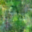
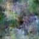
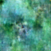
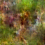
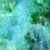
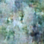

# Postcards From My Jungle

https://samzadgit.github.io/postcards-from-my-jungle/
## What Codex Changed

The original background was a flat black (`--bg`). Codex replaced it with layered gradients and subtle animation to simulate a soft, shifting jungle atmosphere.

### Summary of the Intervention

- Replaced the `body` background with multiple gradients (radial + linear) to add depth and organic color.
- Added two animated pseudo-layers (`body::before` and `body::after`) to create slow, drifting light and shadow.
- Introduced two keyframe animations:
  - `jungle-shift` moves the base gradients over time.
  - `jungle-drift` gently drifts the overlay layers.
- Added `overflow: hidden` to prevent drifting layers from showing edges.

### Files Touched

- `styles.css`

Layered gradients with slow motion mimic the way light moves through dense foliage.

# Model Strategy
Image generation model strategy (from `image-generation.ipynb`)
- Dataset: `lucabaggi/animal-wildlife` from Hugging Face, limited to 1024 samples for speed. This is a broad wildlife dataset, so the model learns general animal structure rather than a specific stylized look.
- Preprocessing: Resize to 64x64, random horizontal flip, normalize to [-1, 1]. This setup favors fast training and low compute cost, but caps detail and texture complexity.
- Model: A small UNet-based model trained from scratch (`UNet2DModel` with attention blocks) using a 1000‑step noise scheduler.
- Training: 6 epochs, batch size 16. This is a lightweight training regime, likely underfitting a diverse dataset but sufficient to produce very low‑res animal silhouettes.
- Generation: Sampling by iterative denoising across all scheduler timesteps, then saving 15 outputs. This implies no classifier‑free guidance or prompt conditioning; the outputs are purely unconditional animals.

Assessment: The strategy prioritizes speed and simplicity over fidelity. It should yield coherent animal shapes at 64x64 but with limited fine detail and weak stylistic control. To improve quality, increase image size, train longer, and/or fine‑tune a larger pretrained diffusion model. Moreover consider curating the dataset to match the intended stylized aesthetic.

Sound generation model strategy (from `sound-generation.ipynb`)
- Model: `stabilityai/stable-audio-open-1.0` accessed through `StableAudioPipeline`. This is a pretrained model; there is no fine‑tuning or training in the notebook.
- Prompting: Single prompt (“Fictional animal vocalizations in a magical forest.”) with a negative prompt (“Low quality.”). Variations are created by changing the random seed for each output.
- Inference settings: 200 inference steps, 21‑second outputs, 15 total sounds. Output audio is written directly from the model without post‑processing.

Assessment: The strategy is purely prompt‑based inference, so quality depends on prompt specificity and sampling settings. It should yield diverse textures but may lack consistent identity across sounds. To improve quality and cohesion, use more detailed prompts per creature, and experiment with guidance settings and duration. If consistent style is critical, consider fine‑tuning on a small curated dataset of similar audio motifs.
