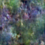

# Postcards From My Jungle

## What Codex Changed

The original background was a flat black (`--bg`). Codex replaced it with layered gradients and subtle animation to simulate a soft, shifting jungle atmosphere.

## Summary of the Intervention

- Replaced the `body` background with multiple gradients (radial + linear) to add depth and organic color.
- Added two animated pseudo-layers (`body::before` and `body::after`) to create slow, drifting light and shadow.
- Introduced two keyframe animations:
  - `jungle-shift` moves the base gradients over time.
  - `jungle-drift` gently drifts the overlay layers.
- Added `overflow: hidden` to prevent drifting layers from showing edges.

## Files Touched

- `styles.css`

Layered gradients with slow motion mimic the way light moves through dense foliage. The effect stays soft and atmospheric, keeping the focus on the artwork while making the background feel alive.
